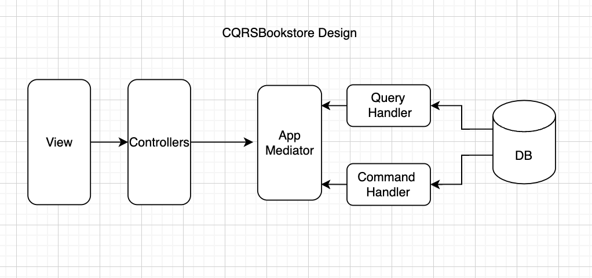
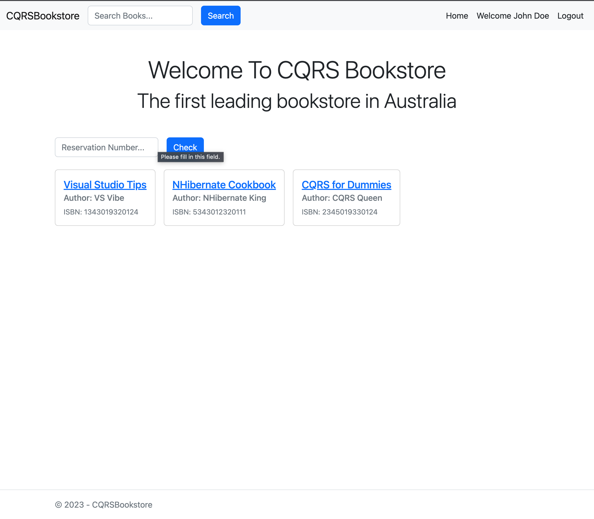
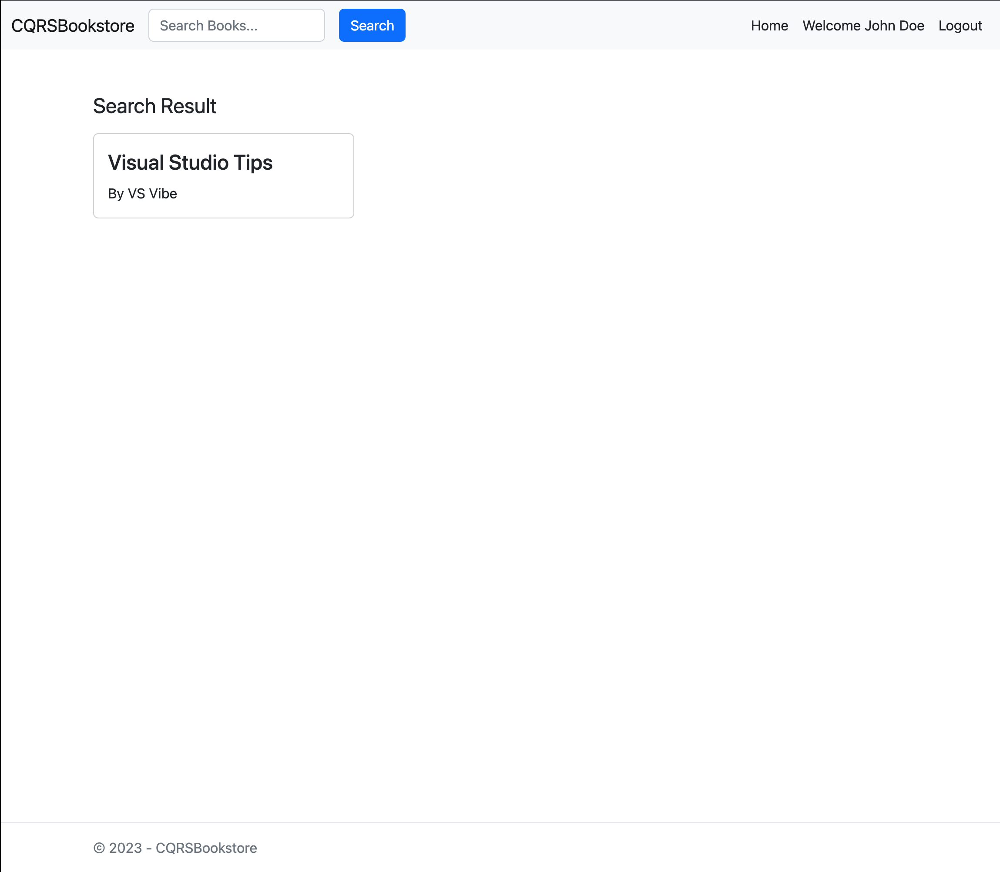
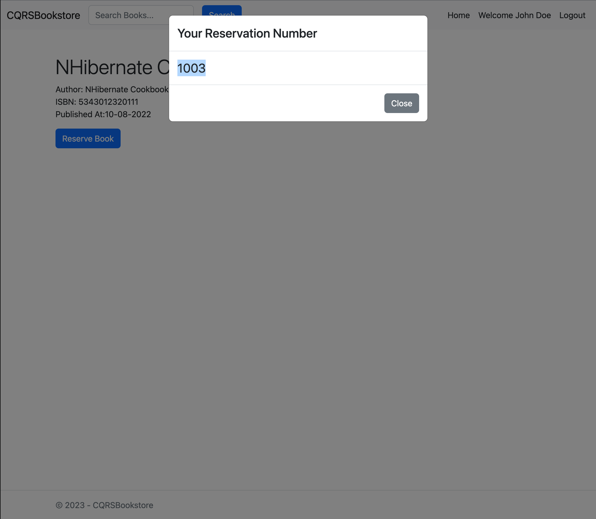
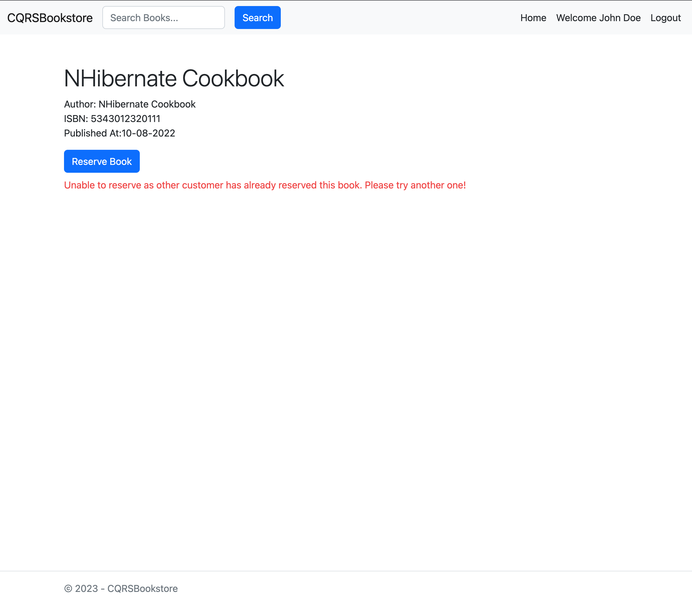
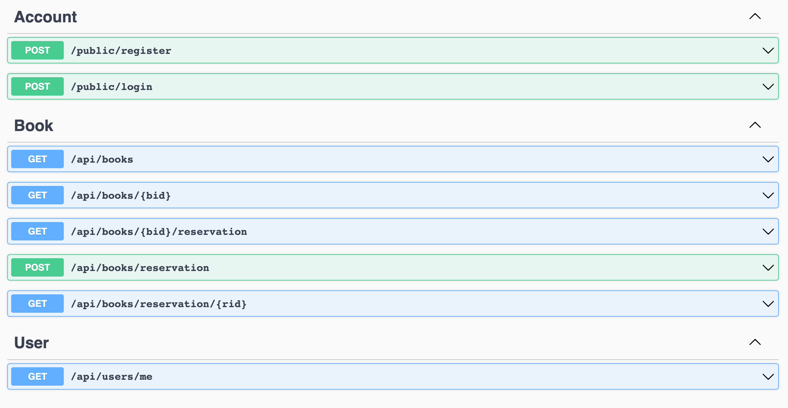

## CQRSBookstore

An online web application system for a bookstore using .NET MVC (C#) or React with .NET .

React Webiste: https://cqrs-bookstore-react.vercel.app (full app)\
MVC Website: https://cqrsbookstore.onrender.com (incomplete app)

| Codebase                                                                              | Description         |
| ------------------------------------------------------------------------------------- | ------------------- |
| [MVC App](https://github.com/kkaung/CQRSBookstore/tree/main/CQRSBookstore.UI/MVC)     | ASP.NET MVC App     |
| [React App](https://github.com/kkaung/CQRSBookstore/tree/main/CQRSBookstore.UI/React) | NextJS Frontend App |
| [Api](https://github.com/kkaung/CQRSBookstore/tree/main/CQRSBookstore.Api)            | .NET Core Server    |
| [App Layer](https://github.com/kkaung/CQRSBookstore/tree/main/CQRSBookstore.App)      | Application Layer   |

-   MVC App Architecture with CQRS Design Pattern

-  React/Angular App Architecture with CQRS Design Pattern

## App Previews

-   Home Page

-   Search Page

-   Successfull Reservation Page

-   Reservation Error Page

-   Api Endpoints

